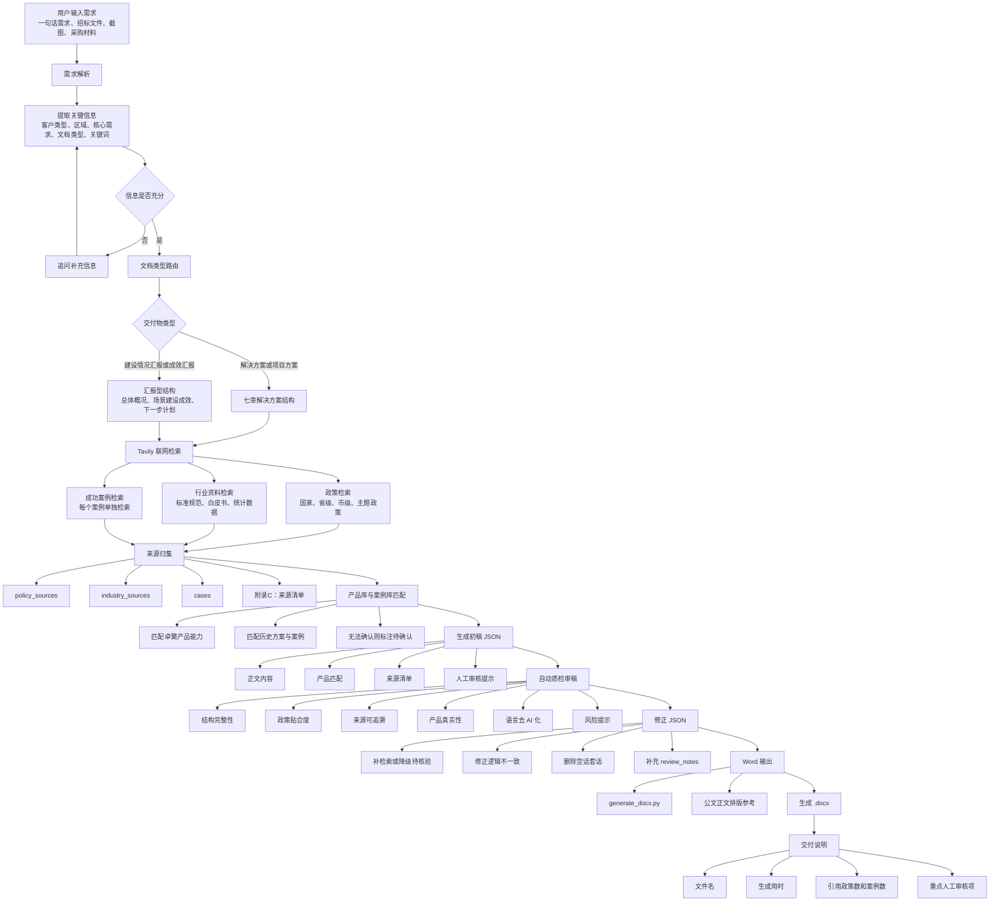
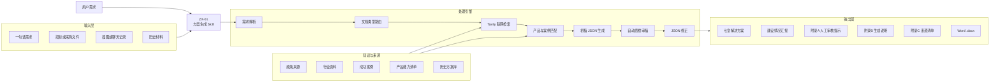

# ZX-01 Skill 流程与架构图

## 流程图

```mermaid
flowchart TD
    A["用户输入需求<br>一句话需求、招标文件、截图、采购材料"] --> B["需求解析"]

    B --> B1["提取关键信息<br>客户类型、区域、核心需求、文档类型、关键词"]
    B1 --> B2{信息是否充分}
    B2 -- 否 --> B3["追问补充信息"]
    B3 --> B1
    B2 -- 是 --> C["文档类型路由"]

    C --> C1{交付物类型}
    C1 -- 解决方案或项目方案 --> D1["七章解决方案结构"]
    C1 -- 建设情况汇报或成效汇报 --> D2["汇报型结构<br>总体概况、场景建设成效、下一步计划"]

    D1 --> E["Tavily 联网检索"]
    D2 --> E

    E --> E1["政策检索<br>国家、省级、市级、主题政策"]
    E --> E2["行业资料检索<br>标准规范、白皮书、统计数据"]
    E --> E3["成功案例检索<br>每个案例单独检索"]

    E1 --> F["来源归集"]
    E2 --> F
    E3 --> F

    F --> F1["policy_sources"]
    F --> F2["industry_sources"]
    F --> F3["cases"]
    F --> F4["附录C：来源清单"]

    F --> G["产品库与案例库匹配"]
    G --> G1["匹配卓繁产品能力"]
    G --> G2["匹配历史方案与案例"]
    G --> G3["无法确认则标注待确认"]

    G --> H["生成初稿 JSON"]
    H --> H1["正文内容"]
    H --> H2["产品匹配"]
    H --> H3["来源清单"]
    H --> H4["人工审核提示"]

    H --> I["自动质检审稿"]
    I --> I1["结构完整性"]
    I --> I2["政策贴合度"]
    I --> I3["来源可追溯"]
    I --> I4["产品真实性"]
    I --> I5["语言去 AI 化"]
    I --> I6["风险提示"]

    I --> J["修正 JSON"]
    J --> J1["补检索或降级待核验"]
    J --> J2["修正逻辑不一致"]
    J --> J3["删除空话套话"]
    J --> J4["补充 review_notes"]

    J --> K["Word 输出"]
    K --> K1["generate_docx.py"]
    K --> K2["公文正文排版参考"]
    K --> K3["生成 .docx"]

    K3 --> L["交付说明"]
    L --> L1["文件名"]
    L --> L2["生成用时"]
    L --> L3["引用政策数和案例数"]
    L --> L4["重点人工审核项"]
```

## 架构图

```mermaid
flowchart LR
    U["用户需求"] --> S["ZX-01<br>方案生成 Skill"]

    subgraph Input[输入层]
        I1["一句话需求"]
        I2["招标或采购文件"]
        I3["截图或聊天记录"]
        I4["历史材料"]
    end

    subgraph Engine[处理引擎]
        P1["需求解析"]
        P2["文档类型路由"]
        P3["Tavily 联网检索"]
        P4["产品与案例匹配"]
        P5["初稿 JSON 生成"]
        P6["自动质检审稿"]
        P7["JSON 修正"]
    end

    subgraph Knowledge[知识与来源]
        K1["政策来源"]
        K2["行业资料"]
        K3["成功案例"]
        K4["产品能力清单"]
        K5["历史方案库"]
    end

    subgraph Output[输出层]
        O1["七章解决方案"]
        O2["建设情况汇报"]
        O3["附录A 人工审核提示"]
        O4["附录B 生成说明"]
        O5["附录C 来源清单"]
        O6["Word .docx"]
    end

    Input --> S
    S --> P1 --> P2 --> P3 --> P4 --> P5 --> P6 --> P7
    Knowledge --> P3
    Knowledge --> P4
    P7 --> Output
```

## 核心说明

ZX-01 不是直接让模型写方案，而是把方案生产拆成“需求解析、联网检索、产品/案例匹配、结构化生成、质检审稿、修正、Word 输出”的流水线，并通过附录C保证政策、行业资料和案例都可追溯。
